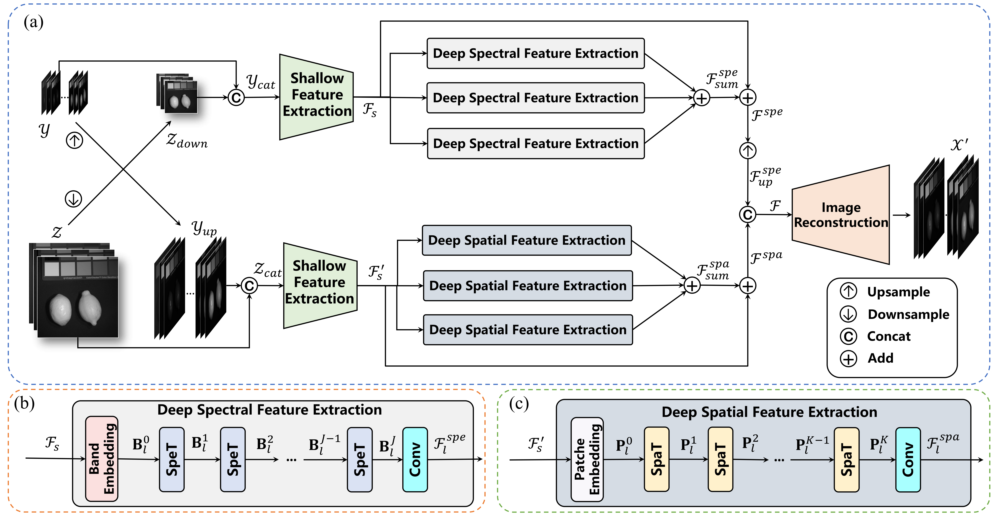
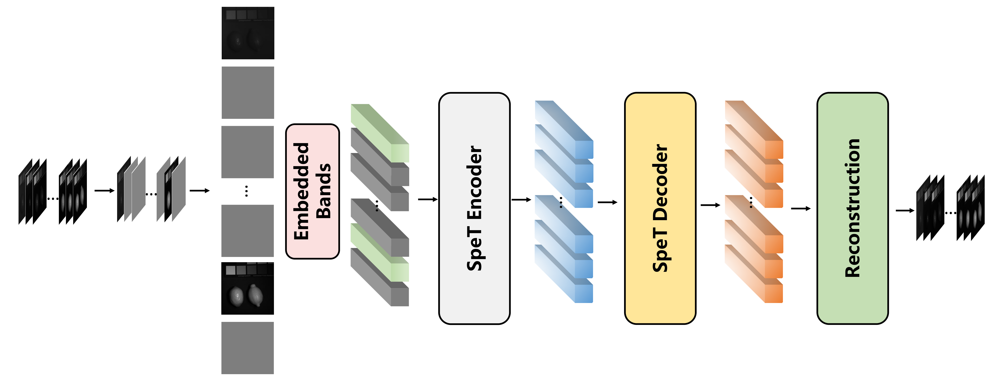
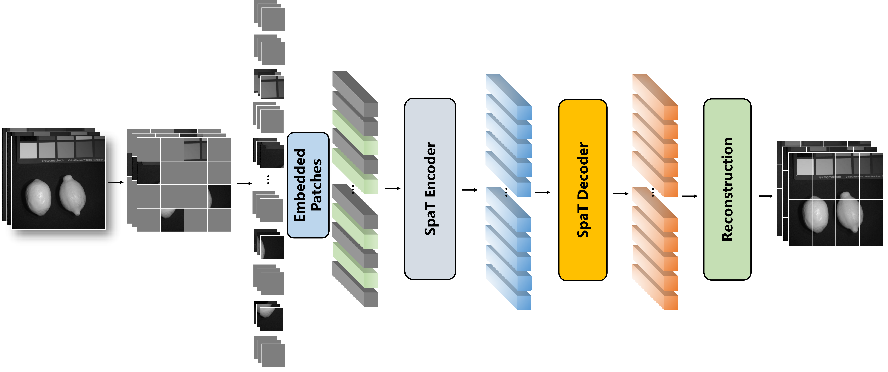

# Multiscale Spatial–spectral Transformer Network for Hyperspectral and Multispectral Image Fusion (MSST-Net)
et

[Sen Jia](https://scholar.google.com.hk/citations?hl=zh-CN&user=UxbDMKoAAAAJ), Zhichao Min, [Xiyou Fu](https://scholar.google.com.hk/citations?user=DFgGGCQAAAAJ&hl=zh-CN&oi=sra)

___________

The code in this toolbox implements the ["Multiscale Spatial–spectral Transformer Network for Hyperspectral and Multispectral Image Fusion"](https://www.sciencedirect.com/science/article/abs/pii/S1566253523000921). More specifically, it is detailed as follow.

<hr />

> **Abstract:** *Fusing hyperspectral images (HSIs) and multispectral images (MSIs) is an economic and feasible way to obtain images with both high spectral resolution and spatial resolution. Due to the limited receptive field of convolution kernels, fusion methods based on convolutional neural networks (CNNs) fail to take advantage
of the global relationship in a feature map. In this paper, to exploit the powerful capability of Transformer to extract global information from the whole feature map for fusion, we propose a novel Multiscale Spatial–spectral Transformer Network (MSST-Net). The proposed network is a two-branch network that integrates the self-attention mechanism of the Transformer to extract spectral features from HSI and spatial features from MSI, respectively. Before feature extraction, cross-modality concatenations are performed to achieve cross-modality information interaction between the two branches. Then, we propose a spectral Transformer (SpeT) to extract spectral features and introduce multiscale band/patch embeddings to obtain multiscale features through SpeTs and spatial Transformers (SpaTs). To further improve the network’s performance and generalization, we proposed a self-supervised pre-training strategy, in which a masked bands autoencoder (MBAE) and a masked patches autoencoder (MPAE) are specially designed for self-supervised pre-training of the SpeTs and SpaTs. Extensive experiments on simulated and real datasets illustrate that the proposed network can achieve better performance when compared to other state-of-the-art fusion methods. The code of MSST-Net will be available at http://www.jiasen.tech/papers/ for the sake of reproducibility.* 
<hr />


## Network Architecture
- The overall architecture diagram of our proposed multiscale spatial–spectral Transformer network.
<!--  -->
<div aligh=center witdh="200"></div>


- The architecture diagram of the masked patches autoencoder.
<!--  -->


- The architecture diagram of the masked bands autoencoder.
<!--  -->


## 1. Create Envirement:

- Python 3 (Recommend to use [Anaconda](https://www.anaconda.com/download/#linux))

- NVIDIA GPU + [CUDA](https://developer.nvidia.com/cuda-downloads)


## 2. Data Preparation:
- Download the CAVE dataset from <a href="https://www1.cs.columbia.edu/CAVE/databases/multispectral">here</a>.

- Download the Harvard dataset from <a href="http://vision.seas.harvard.edu/hyperspec/explore.html">here</a>.

- Download the WDCM dataset `.mat` files from <a href="https://pan.baidu.com/s/13rq0Ov2tEbLrhZWY6_N8mQ">here</a> (code: gtgr) for a quick start and place them in `MSST-Net/data/`.


## 3. Pre-training
- To pre-train MBAE, run

```shell
# Training on CAVE dataset
python main_hsi.py --save_dir ./train_hsi/cave/8/1 --dataset cave --ratio 8 --hsi_channel 31 --hsi_embed_dim 32 --hsi_mask_ratio 0.75 --device cuda:0
```

- To pre-train MPAE, run

```shell
# Training on CAVE dataset
python main_msi.py --save_dir ./train_msi/cave/8/16 --dataset cave --ratio 8 --msi_channel 3 --msi_embed_dim 256 --hsi_mask_ratio 0.5 --patch_size 16 --device cuda:0
```

## 4. Fine-tuning
To fine-tune MSST-Net, run

```shell
# Training on CAVE dataset
python main.py --save_dir ./train/cave/8 --dataset cave --ratio 8 --hsi_channel 31 --msi_channel 3 --hsi_embed_dim 32 --msi_embed_dim 256 --n_feats 64 --patch_size 16  --hsi_model_path_1 ./train_hsi/8/1/model/model_05000.pt --hsi_model_path_2 ./train_hsi/8/2/model/model_05000.pt --hsi_model_path_3 ./train_hsi/8/3/model/model_05000.pt  --msi_model_path_16 ./train_msi/8/16/model/model_05000.pt --msi_model_path_8 ./train_msi/8/8/model/model_05000.pt --msi_model_path_32 ./train_msi/8/32/model/model_05000.pt --device cuda:0
```

## 5. Testing:
To test a trained model, run 

```shell
# Testing on CAVE dataset
python test.py --save_dir ./test/cave/8 --dataset cave --ratio 8 --hsi_channel 31 --msi_channel 3 --hsi_embed_dim 32 --msi_embed_dim 256 --n_feats 64 --patch_size 16  --model_path ./train/cave/8/model/model_05000.pt --device cuda:0
```

## Citation
If this repo helps you, please consider citing our works:


```
@ARTICLE{jia2023multiscale,
  title={Multiscale spatial-spectral transformer network for hyperspectral and multispectral image fusion},
  author={Jia, Sen and Min, Zhichao and Fu, Xiyou},
  journal={Information Fusion}, 
  year={2023},
  volume={96},
  pages={117-129}
}
```
